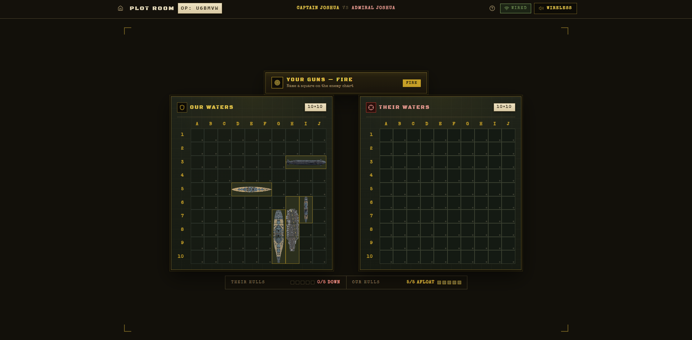

# Battleship Game


Realtime 2-player Battleship with a WWII operations-room theme. Host creates an operation, shares a 6-character cipher or invite link, both deploy 5 hulls, then trade shots until one fleet is on the bottom.

## Gameplay



## Features

- Room-based multiplayer (Supabase Realtime + local-tab relay fallback)
- Ship placement with rotate (R), randomize, and validity preview
- Turn-based battle with hit / miss / sunk reveals and game-over report
- Procedural Web Audio effects with mute toggle
- Invite links (`/?join=CODE` and `/join/CODE`)

## Quickstart

```bash
npm install
npm run dev
```

Build and preview:

```bash
npm run build
npm run preview
```

Lint:

```bash
npm run lint
```

## Environment

| Variable                 | Purpose              |
| ------------------------ | -------------------- |
| `VITE_SUPABASE_URL`      | Supabase project URL |
| `VITE_SUPABASE_ANON_KEY` | Supabase anon key    |

Without these the game still works across tabs on the same machine via `BroadcastChannel`. For cross-device play, run `supabase-policies.sql` once in the Supabase SQL editor, then set the variables (Vercel or `.env`).

## Multiplayer protocol

Broadcast events on `battleship-room:<CODE>`:

`GUEST_JOINED` → `ROOM_SYNC` → `PLAYER_READY` → `GAME_STARTED` → `ATTACK` → `ATTACK_RESULT`, plus `REMATCH_REQUEST` and `OPPONENT_LEFT`.

Fleets stay private in each browser; the defender validates every attack and only sunk ships are revealed. Player 1 always fires first.

## Project structure

```text
src/
  components/battleship/  boards, cells, placement, turn + result banners
  components/lobby/       create / join / room lobby
  components/ui/          how-to-play, sound toggle, Supabase config
  hooks/useMultiplayer.ts realtime room state machine
  lib/                    gameLogic, roomCode, sound, supabase
  pages/                  Home, Game
  config/ships.ts         fleet definitions
  types/battleship.ts     shared protocol types
supabase-policies.sql     anon RLS policies for public.rooms
scripts/pad-ship-sprites.py sprite aspect helper
```
